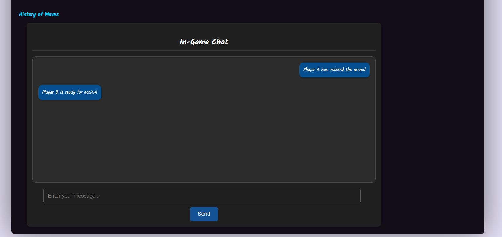
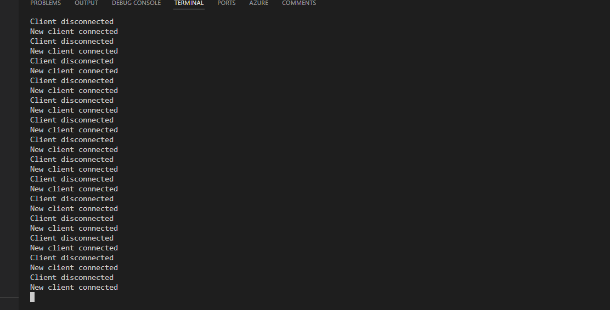
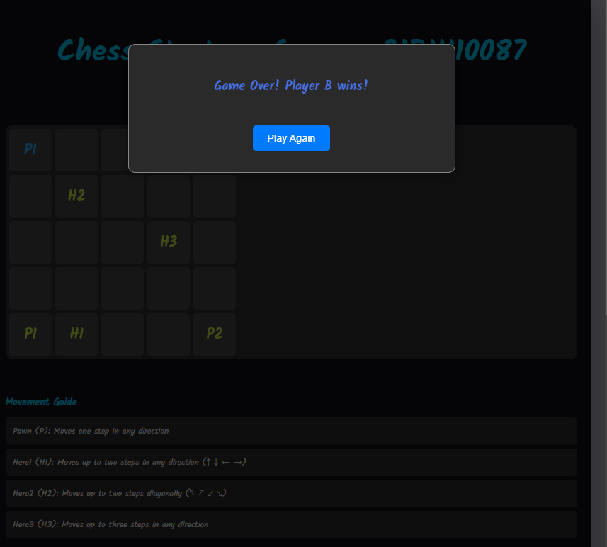
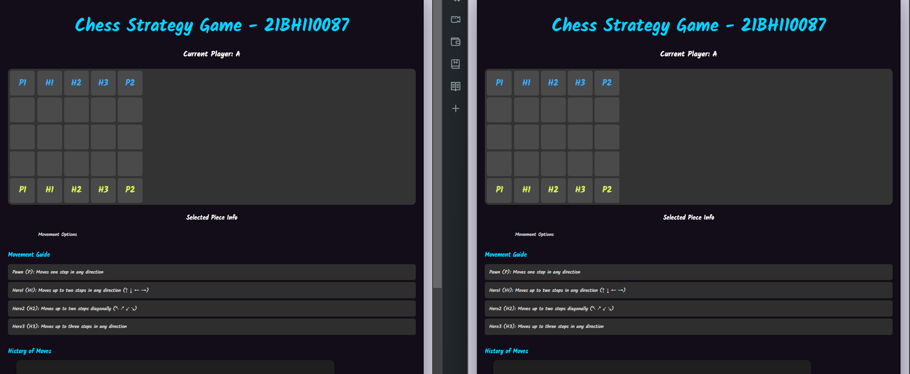
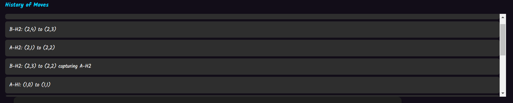
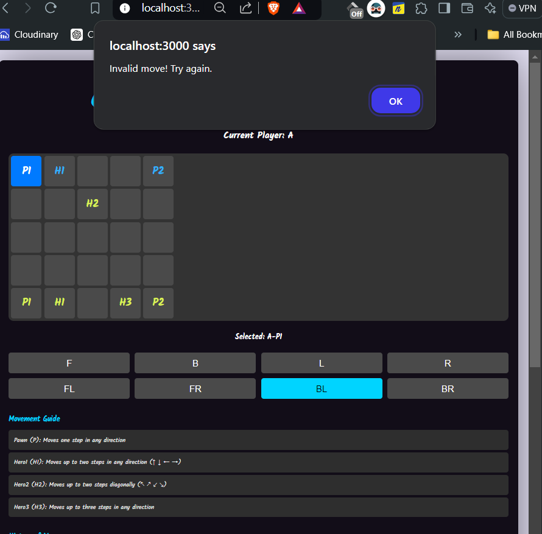
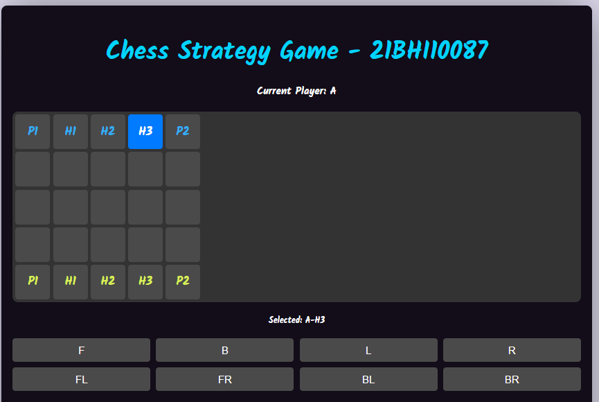
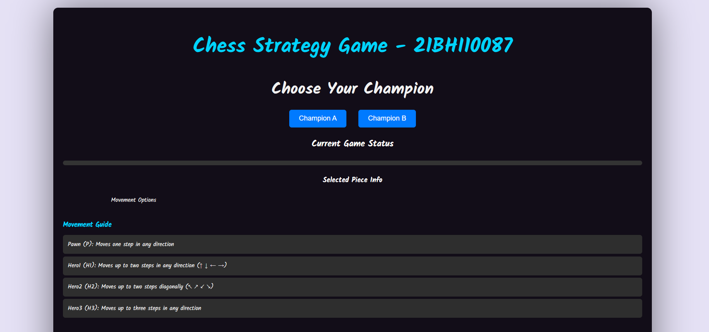

# Advanced Chess-like Game

Welcome to the Chess-like Game! This project is a unique twist on traditional chess, featuring custom gameplay mechanics, an integrated chat system, and a modern user interface.

## Table of Contents

- [Overview](#overview)
- [Features](#features)
- [Gameplay Instructions](#gameplay-instructions)
  - [Option 1: Play via Deployed Link](#option-1-play-via-deployed-link)
  - [Option 2: Play Locally](#option-2-play-locally)
- [Piece Movement Rules](#piece-movement-rules)
- [User Interface Previews](#user-interface-previews)
- [Getting Started](#getting-started)
  - [Clone the Repository](#clone-the-repository)
  - [Install Dependencies](#install-dependencies)
  - [Start the Application](#start-the-application)

## Overview

This game allows two players to engage in a strategic battle where each piece has unique movement capabilities. The game is enhanced by an in-game chat feature, allowing players to communicate during gameplay. The interface is designed to be intuitive and visually appealing, ensuring an enjoyable experience for all users.

## Features

- **Custom Gameplay Mechanics**: Each piece has distinct movement rules, offering a fresh challenge beyond traditional chess.
- **Real-time Chat**: Communicate with your opponent using the integrated chat system.
- **Move History**: Track all moves made during the game.
- **Responsive UI**: The game interface is optimized for both desktop and mobile devices.
- **Game Over Modal**: A modal appears when the game ends, providing options to start a new game.

## Gameplay Instructions

### Option 1: Play via Deployed Link

1. Open the deployed link (e.g., on Render) in **two separate browser tabs**.
2. In the first tab, select **Player A** by clicking the corresponding button.
3. In the second tab, select **Player B**.
4. Begin playing the game by making moves and sending messages via the chat.

### Option 2: Play Locally

1. **Clone the repository** to your local machine.
2. Navigate to the root folder of the project.
3. Install the dependencies using `npm install`.
4. Start the application using `npm start`.
5. Open `http://localhost:3000` in **two separate browser tabs**.
6. In the first tab, select **Player A** and in the second tab, select **Player B** to start the game.

## Piece Movement Rules

Each piece in the game has its unique movement capability:

- **Pawn (P)**: Moves 1 step in any direction.
- **Hero1 (H1)**: Moves up to 2 steps in any direction (↑ ↓ ← →).
- **Hero2 (H2)**: Moves up to 2 steps diagonally (↖ ↗ ↙ ↘).
- **Hero3 (H3)**: Moves up to 3 steps in any direction.

## User Interface Previews

Here are some previews of the game's user interface:

- **Game Chat**: 
  

- **Chat Example 2**:
  

- **Client Connection Screen**:
  

- **Game Over Screen**:
  

- **Game Start Screen**:
  

- **History of Moves**:
  

- **Invalid Move Notification**:
  

- **Options Menu**:
  

- **Main Page**:
  

## Getting Started

### Clone the Repository

```bash
git clone https://github.com/yourusername/advanced-chess-like-game.git
cd advanced-chess-like-game
